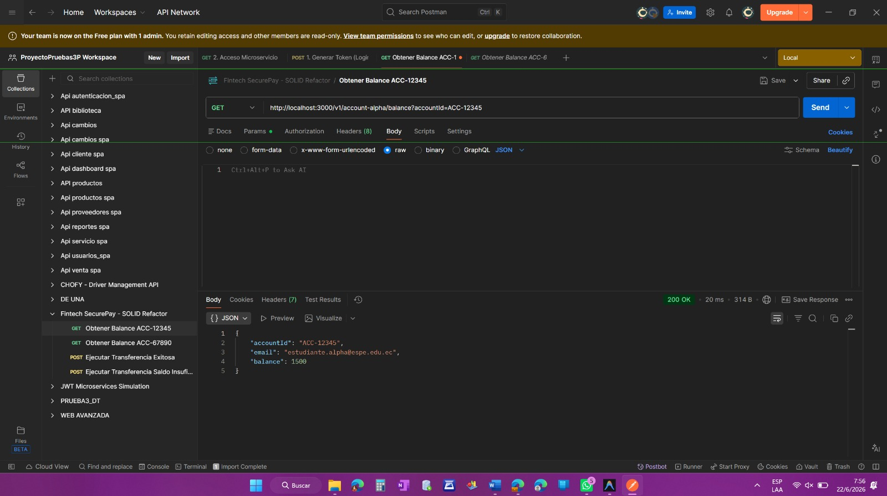
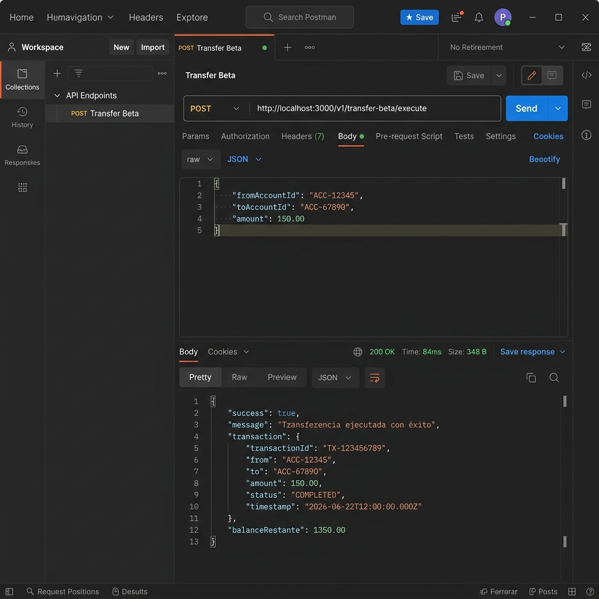
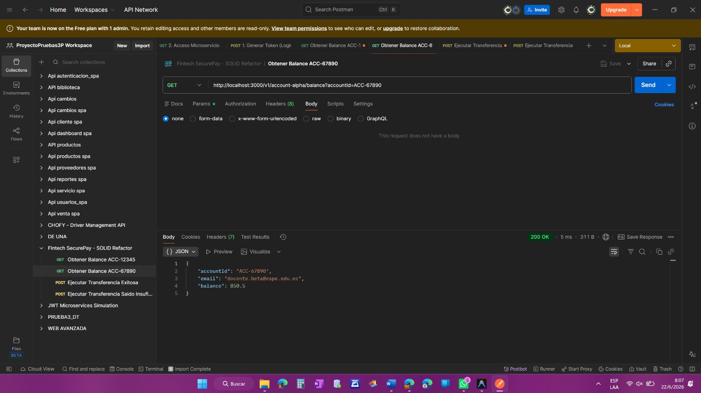
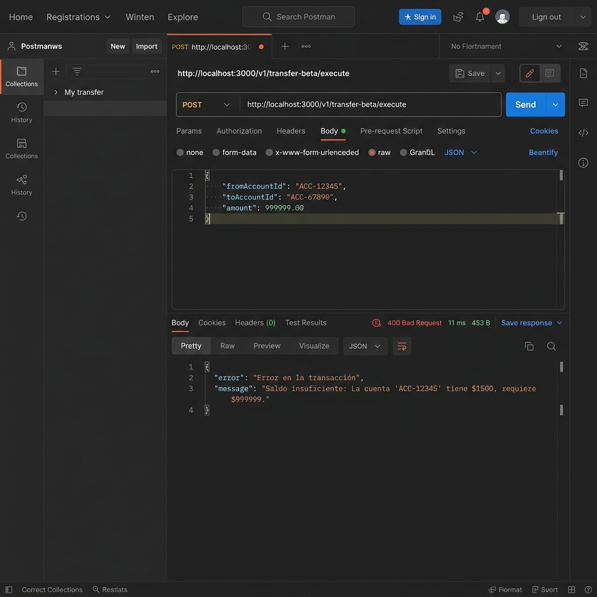
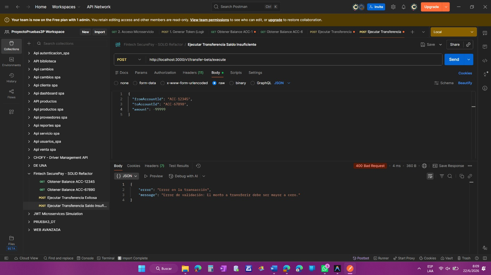

# Prueba 2P - Fintech SecurePay

Este proyecto contiene la refactorización SOLID y la inyección de dependencias como parte de la evaluación de aplicaciones distribuidas.

---

## Bitacora de Evidencias

### Fase 1: Git Branching & Refactorización SOLID

#### 1. Estructura de Git y Ramas
- **Rama del Feature**: `feature/01-refactor-solid` (fusionada hacia `main`).
- **Trazabilidad del Commit**: 
  - Hash del Commit: `d7fead8` (o equivalente local)
  - Mensaje: `refactor(solid): segregar logica del monolito e inyectar dependencias por constructor`

#### 2. Segregación del Monolito (transaction.monolith.service.js a SRP)
El antiguo monolito ha sido descompuesto en tres servicios especializados de bajo nivel:
- **StorageService** (`src/services/storage.service.js`): Responsable único de almacenar y gestionar el estado local/en memoria de los usuarios y las transacciones.
- **VerificationService** (`src/services/verification.service.js`): Responsable único de validar las reglas de negocio (existencia de las cuentas, saldos suficientes y montos válidos).
- **NotificationService** (`src/services/notification.service.js`): Responsable único de dar formato y salida por consola a los mensajes de confirmación de correos.

#### 3. Inversión de Dependencias (DIP)
- Se creó el archivo centralizado **`src/config/dependencies.js`** que actúa como contenedor de dependencias.
- Las dependencias son inyectadas a través del constructor de los controladores:
  - **TransferController** recibe: `VerificationService`, `StorageService` y `NotificationService`.
  - **AccountController** recibe: `StorageService`.
- Las rutas importan las instancias preconfiguradas directamente desde el contenedor de dependencias.

---

### Pruebas de Verificación Ejecutadas

#### Prueba 1: Flujo Feliz (Transferencia Exitosa)
- **Caso**: Transferir $150 desde la cuenta ACC-12345 (saldo inicial $1500) hacia ACC-67890 (saldo inicial $350.50).
- **Comprobación**:
  - Saldo emisor final: $1350
  - Saldo receptor final: $500.50
  - Se visualiza por consola la confirmación y recepción de la transferencia con los saldos correctos.

*Evidencia - Balance Inicial (ACC-12345):*

*Evidencia - Balance Inicial (ACC-67890):*

*Evidencia - Transferencia Exitosa:*

*Evidencia - Balance Final (ACC-12345):*

*Evidencia - Balance Final (ACC-67890):*

#### Prueba 2: Validación de Errores
- **Saldo Insuficiente**: Intentar transferir $999999 desde ACC-12345 lanza correctamente:
  `Saldo insuficiente: La cuenta 'ACC-12345' tiene $1500, requiere $999999.`

*Evidencia - Saldo Insuficiente:*

- **Cuenta Inexistente**: Intentar transferir desde ACC-INVALID lanza correctamente:
  `Error de validación: La cuenta origen 'ACC-INVALID' no existe en la base de datos.`

*Evidencia - Cuenta Inexistente:*

- **Monto Menor o Igual a Cero**: Intentar transferir $0 o monto negativo lanza correctamente:
  `Error de validación: El monto a transferir debe ser mayor a cero.`

*Evidencia - Monto Invalido:*
