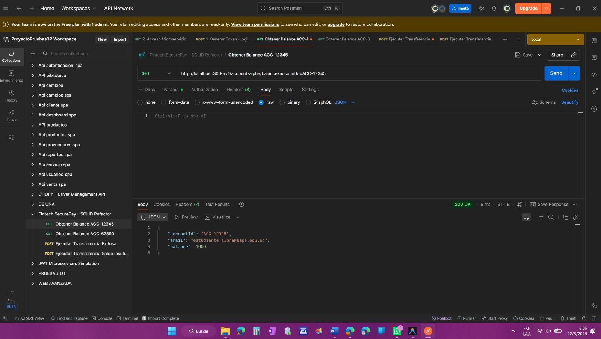
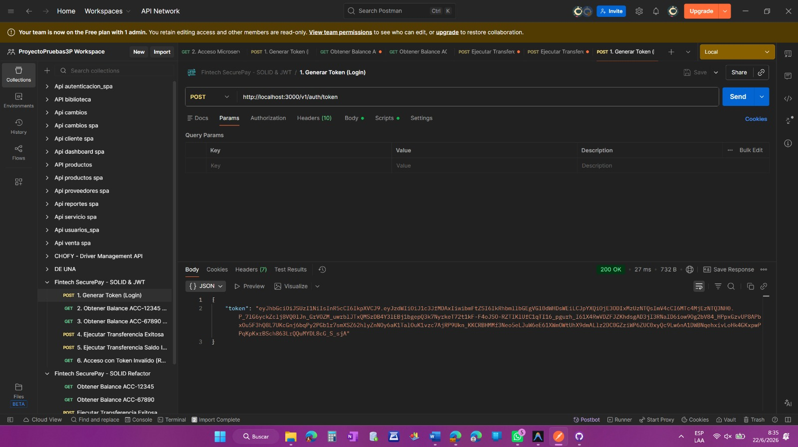
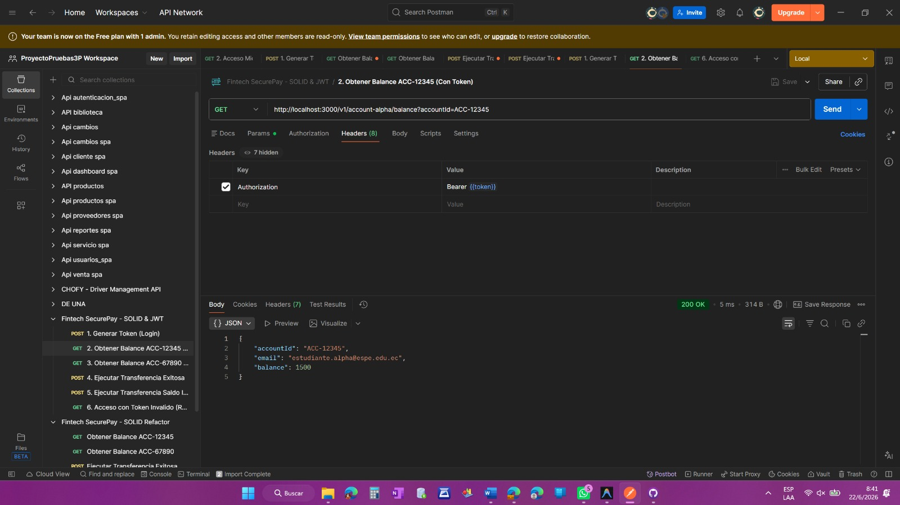
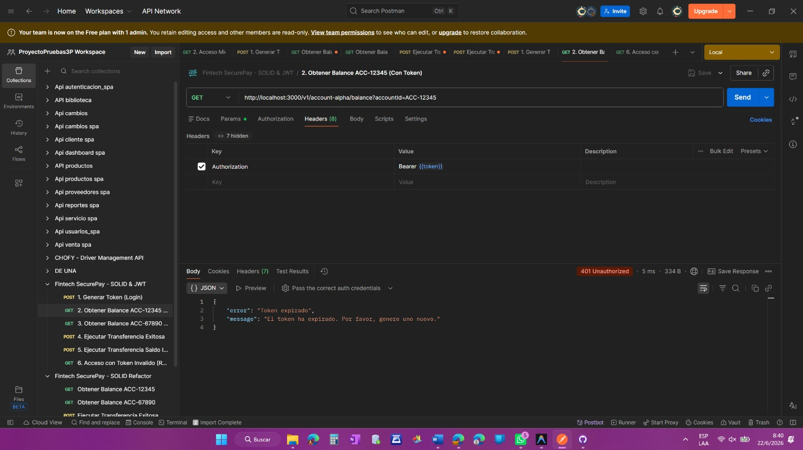
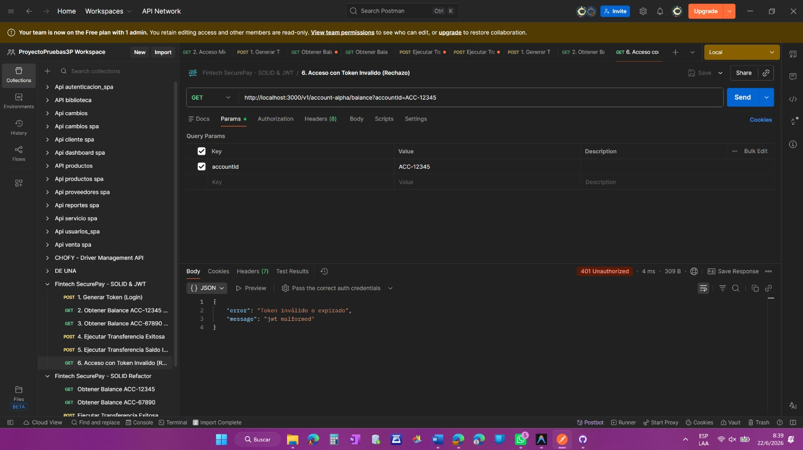
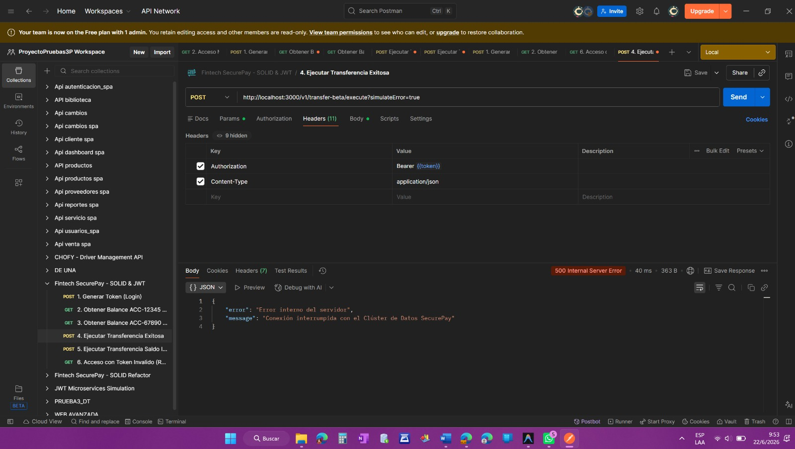
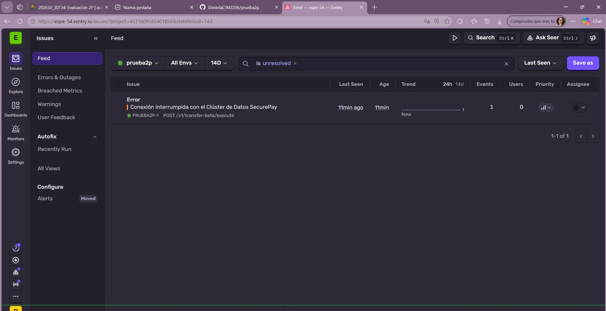
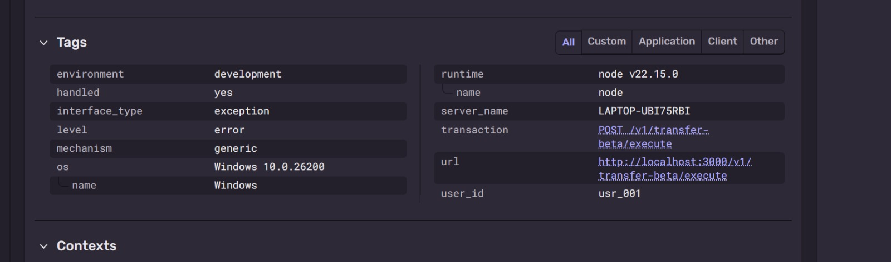

# Prueba 2P - Fintech SecurePay

Este proyecto contiene la refactorización SOLID y la inyección de dependencias como parte de la evaluación de aplicaciones distribuidas.

---

## Bitacora de Evidencias

### Fase 1: Git Branching & Refactorización SOLID

#### 1. Estructura de Git y Ramas
- **Rama del Feature**: `feature/01-refactor-solid` (fusionada hacia `main`).
- **Trazabilidad del Commit**: 
  - Hash del Commit: `d7fead8` (o equivalente local)
  - Mensaje: `refactor(solid): segregar logica del monolito e inyectar dependencias por constructor`

#### 2. Segregación del Monolito (transaction.monolith.service.js a SRP)
El antiguo monolito ha sido descompuesto en tres servicios especializados de bajo nivel:
- **StorageService** (`src/services/storage.service.js`): Responsable único de almacenar y gestionar el estado local/en memoria de los usuarios y las transacciones.
- **VerificationService** (`src/services/verification.service.js`): Responsable único de validar las reglas de negocio (existencia de las cuentas, saldos suficientes y montos válidos).
- **NotificationService** (`src/services/notification.service.js`): Responsable único de dar formato y salida por consola a los mensajes de confirmación de correos.

#### 3. Inversión de Dependencias (DIP)
- Se creó el archivo centralizado **`src/config/dependencies.js`** que actúa como contenedor de dependencias.
- Las dependencias son inyectadas a través del constructor de los controladores:
  - **TransferController** recibe: `VerificationService`, `StorageService` y `NotificationService`.
  - **AccountController** recibe: `StorageService`.
- Las rutas importan las instancias preconfiguradas directamente desde el contenedor de dependencias.

---

### Pruebas de Verificación Ejecutadas

#### Prueba 1: Flujo Feliz (Transferencia Exitosa)
- **Caso**: Transferir $150 desde la cuenta ACC-12345 (saldo inicial $1500) hacia ACC-67890 (saldo inicial $350.50).
- **Comprobación**:
  - Saldo emisor final: $1350
  - Saldo receptor final: $500.50
  - Se visualiza por consola la confirmación y recepción de la transferencia con los saldos correctos.

*Evidencia - Balance Inicial (ACC-12345):*

*Evidencia - Balance Inicial (ACC-67890):*

*Evidencia - Transferencia Exitosa:*

*Evidencia - Balance Final (ACC-12345):*

*Evidencia - Balance Final (ACC-67890):*

#### Prueba 2: Validación de Errores
- **Saldo Insuficiente**: Intentar transferir $999999 desde ACC-12345 lanza correctamente:
  `Saldo insuficiente: La cuenta 'ACC-12345' tiene $1500, requiere $999999.`

*Evidencia - Saldo Insuficiente:*

- **Cuenta Inexistente**: Intentar transferir desde ACC-INVALID lanza correctamente:
  `Error de validación: La cuenta origen 'ACC-INVALID' no existe en la base de datos.`

*Evidencia - Cuenta Inexistente:*

- **Monto Menor o Igual a Cero**: Intentar transferir $0 o monto negativo lanza correctamente:
  `Error de validación: El monto a transferir debe ser mayor a cero.`

*Evidencia - Monto Invalido:*

---

### Fase 2: Seguridad y Autenticación Asimétrica Stateless

#### 1. Estructura de Git y Ramas
- **Rama del Feature**: `feature/02-auth-jwt` (fusionada hacia `main`).
- **Trazabilidad del Commit**:
  - Hash del Commit: `799347c` (o equivalente local)
  - Mensaje: `feat(jwt): implementar firmado asimetrico rs256 y middleware de validacion autonoma public-key`

#### 2. Criptografía Asimétrica (RS256)
- Se ejecutó el script `keypair.sh` mediante OpenSSL para generar las llaves:
  - `private.pem`: Utilizada para firmar el token JWT. Excluida de Git.
  - `public.pem`: Utilizada de forma autónoma por el middleware para verificar la firma del token sin consultar bases de datos. Excluida de Git.

#### 3. Implementación de Servicios y Middleware
- **`src/services/jwt.service.js`**:
  - `signToken(user)`: Carga la llave privada e implementa la firma asimétrica RS256 con claims estructurados (`sub: user.id`, `name: user.name`) y expiración de 2 minutos (`expiresIn: '2m'`).
  - `verifyToken(token)`: Carga la llave pública y valida la autenticidad y fecha de expiración del token.
- **`src/middlewares/auth.middleware.js`**:
  - Extrae el token desde la cabecera `Authorization: Bearer <token>`.
  - Llama a `jwtService.verifyToken` para realizar la verificación autónoma.
  - Adjunta el payload decodificado a `req.user` para uso posterior.
  - Retorna errores controlados de tipo `Token expirado` (cuando se detecta `TokenExpiredError`) y `Token inválido o expirado` para firmas corruptas o malformadas.

---

### Pruebas de Verificación Ejecutadas (Fase 2)

#### Prueba 1: Generación de Token (Login)
- **Caso**: Enviar credenciales válidas (`admin`/`admin123`) a `POST /v1/auth/token`.
- **Comprobación**: Se obtiene un token JWT firmado de forma asimétrica.

*Evidencia - Generación de Token:*

#### Prueba 2: Acceso Autorizado (Flujo Feliz)
- **Caso**: Enviar el token generado en la cabecera de autorización a `GET /v1/account-alpha/balance?accountId=ACC-12345`.
- **Comprobación**: El middleware valida el token usando la llave pública de manera autónoma y permite la consulta devolviendo los datos de la cuenta con código HTTP 200.

*Evidencia - Acceso Exitoso con Token:*

#### Prueba 3: Rechazo por Expiración
- **Caso**: Esperar 2 minutos y enviar el mismo token a `GET /v1/account-alpha/balance`.
- **Comprobación**: El middleware detecta la expiración y retorna un error controlado (código HTTP 401).

*Evidencia - Token Expirado:*

#### Prueba 4: Rechazo por Token Inválido o Malformado
- **Caso**: Enviar un token inválido o corrupto a `GET /v1/account-alpha/balance`.
- **Comprobación**: El middleware detecta que la firma o estructura es inválida y retorna error con código HTTP 401.

*Evidencia - Token Invalido:*

---

### Fase 3: Observabilidad y Error Tracking Real-Time

#### 1. Estructura de Git y Ramas
- **Rama del Feature**: `feature/03-observabilidad` (fusionada hacia `main`).
- **Trazabilidad del Commit**:
  - Hash del Commit: `39d381e` (o equivalente local)
  - Mensaje: `feat(sentry): instrumentar backend y separar manejo de excepciones logicas 401 de fallos operacionales 500`

#### 2. Integración de Sentry SDK
- **`src/instrument.js`**: Carga las variables de entorno e inicializa Sentry con el DSN.
- **`index.js`**:
  - Importa `src/instrument.js` en la primera línea absoluta del archivo de arranque.
  - Registra `Sentry.setupExpressErrorHandler(app)` inmediatamente antes de declarar el manejador de errores global predeterminado.

#### 3. Diferenciación de Excepciones
- **Excepciones Lógicas (No alertadas a Sentry)**:
  - Capturadas en `auth.middleware.js`. Retornan un estado HTTP 401 controlado sin contaminar el dashboard de Sentry.
- **Errores Operacionales (Alertadas a Sentry)**:
  - En `TransferController`, al recibir el parámetro `simulateError=true` en query o body, se lanza el error `Conexión interrumpida con el Clúster de Datos SecurePay`.
  - El error se captura en el catch del controlador, se añade el scope `user_id` recuperado del JWT (`req.user.sub`), se reporta a Sentry con `Sentry.captureException` y se responde un código HTTP 500.

---

### Pruebas de Verificación Ejecutadas (Fase 3)

#### Prueba 1: Simulación de Error Operacional 500
- **Caso**: Enviar una petición autenticada a `POST /v1/transfer-beta/execute?simulateError=true`.
- **Comprobación**: El servidor responde con código HTTP 500 e imprime el log de error en consola.

*Evidencia - Respuesta de Error Operacional (500):*

#### Prueba 2: Reporte del Incidente en Sentry
- **Caso**: Revisar el Dashboard de Sentry tras disparar el error operacional.
- **Comprobación**: Se registra el problema con el mensaje `Conexión interrumpida con el Clúster de Datos SecurePay`.

*Evidencia - Sentry Dashboard (Incidente):*

#### Prueba 3: Validación del Tag user_id en Sentry
- **Caso**: Inspeccionar el detalle del error en Sentry.
- **Comprobación**: Se valida que la sección de Tags contenga el parámetro `user_id` asociado al claim `sub` del usuario autenticado (ej: `usr_001`).

*Evidencia - Sentry Tags (user_id):*
